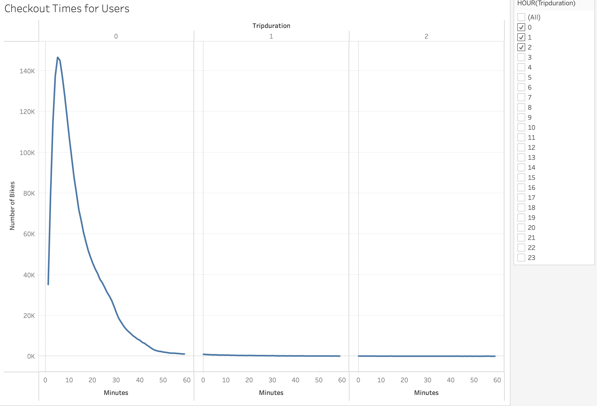
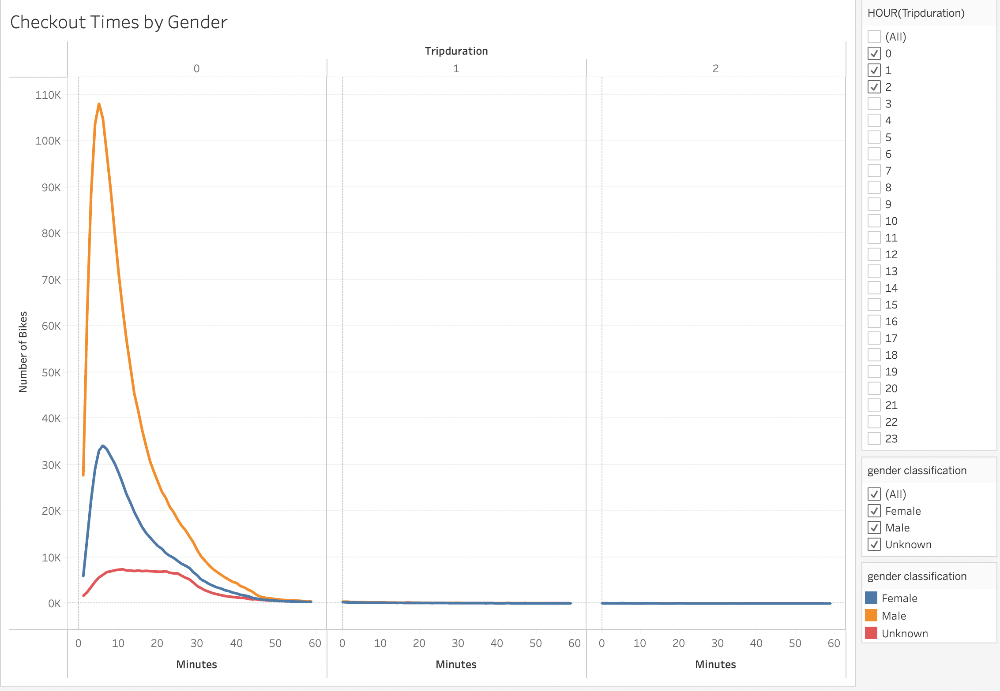
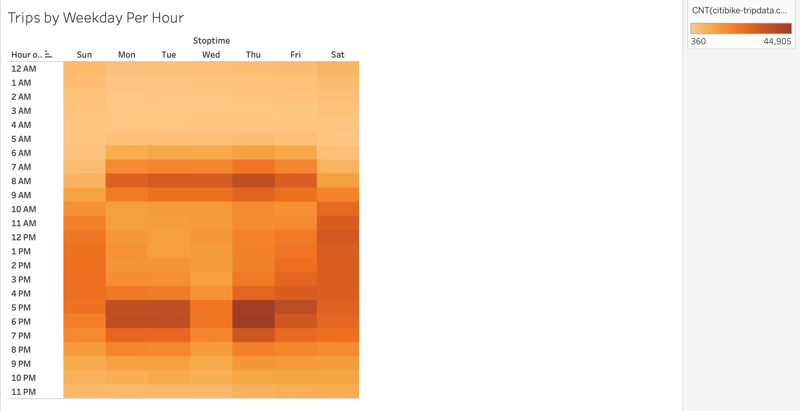
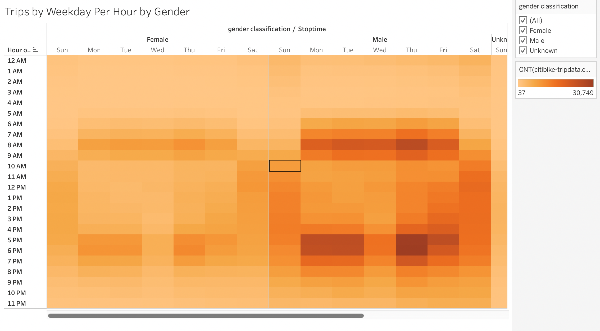
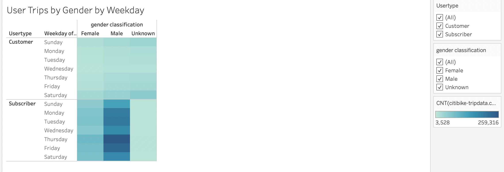

# BikeSharing

## Purpose: 
Provide more data vizalizations for investors to demonstrate that a bike-sharing program in Des Moines is a solid buisness proposal. In order to convice the stakeholders, show them the following:
- Show the length of time that bikes are checked out for all riders and genders
- Show the number of bike trips for all riders and genders for each hour of each day of the week
- Show the number of bike trips for each type of user and gender for each day of the week.
Here is a [link to dashboard](
## Results:
### Length of time that bikes are checked out by riders
From this visualization, we can see that all users stop riding the bikes by the first hour. We can also see most riders will stop riding after 10 minutes and then users drop exponentially thereafter.

### Length of time that bikes are checks by gender
From this visualization, we can see most riders idenify as male, followed by riders who identify as female, and last being unkown genders.

### Number of bike trips for all riders for each day of the week (by the hour)
From this visualization, we can see a majority of the busiest times of day are between 8AM-9AM and 5PM-7PM during the Monday-Friday work week. The busiest day of the week during those times is Thursday.

### Number of bike trips for each gender for each day of the week (by the hour)
From this visualization, we can see Males are the primary riders during the busy hours and days of the week.

### Number of Types of Users by Gender by day of the week
From this visualization, we can see a majority of the riders identify as male and aer subscribers of the bike share app.

### Users by Gender
From this visualization, we can confirm that most riders who use the app identify as male.

## Summary:

There is a high-level summary of the results and two additional visualizations are suggested for future analysis (5 pt)
