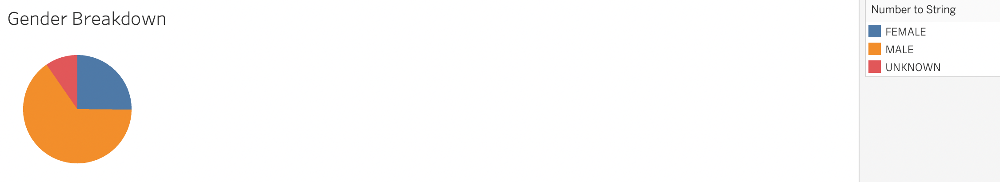
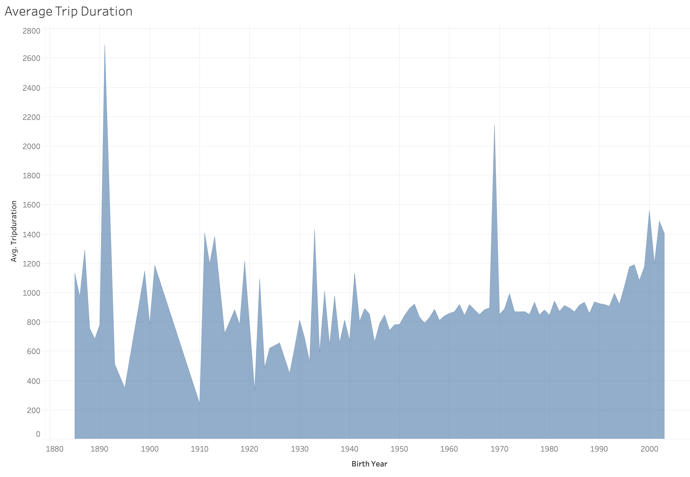

# BikeSharing

## Purpose: 
Provide more data vizalizations for investors to demonstrate that a bike-sharing program in Des Moines is a solid buisness proposal. In order to convice the stakeholders, show them the following:
- Show the length of time that bikes are checked out for all riders and genders
- Show the number of bike trips for all riders and genders for each hour of each day of the week
- Show the number of bike trips for each type of user and gender for each day of the week.   
Here is a [link to dashboard](https://public.tableau.com/app/profile/kathryn.alicia.bottenberg/viz/Module15Challenge_16702902233190/AverageTripDuration)
## Results:
### Length of time that bikes are checked out by riders
From this visualization, we can see that all users stop riding the bikes by the first hour. We can also see most riders will stop riding after 10 minutes and then users drop exponentially thereafter.

### Length of time that bikes are checks by gender
From this visualization, we can see most riders identify as male, followed by riders who identify as female, and last being unkown genders.

### Number of bike trips for all riders for each day of the week (by the hour)
From this visualization, we can see a majority of the busiest times of day are between 8AM-9AM and 5PM-7PM during the Monday-Friday work week. The busiest day of the week during those times is Thursday.

### Number of bike trips for each gender for each day of the week (by the hour)
From this visualization, we can see Males are the primary riders during the busy hours and days of the week.

### Number of Types of Users by Gender by day of the week
From this visualization, we can see a majority of the riders identify as male and aer subscribers of the bike share app.

### Users by Gender
From this visualization, we can confirm that most riders who use the app identify as male.

### Average Trip Duration by Age
From this visualization, we can see that there are obviously users who do not put the approproate birth year, which would explain the inconsistencies in averages before 1950. 

## Summary:
In summary, most rides end after about 21 minutes and a large portion of those rides are by people who identify as male. a large portion of the rides only last about 10 minutes. The busiest times for riders are during commuting hours, 8AM-9AM and 5PM-7PM with Thursday being the busiest day. When comparing the genders to the number of riders during specific hours, male and female remain pretty similar. 
Next steps, would be to to look into if gender and location have any correlation, we could create a map with gender and the number of rides in the area. Another query to look into would be trip duration and subscribers verse customers, answering the question, Does being a non subscriber affect the duration of the ride?
